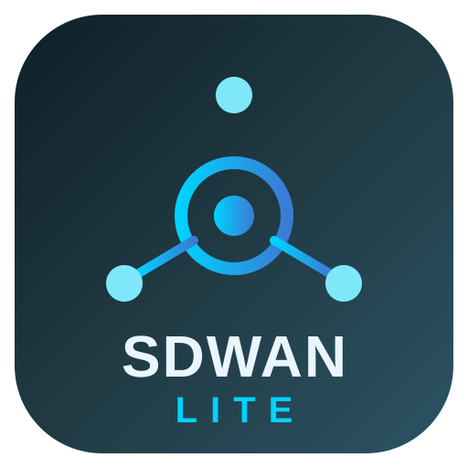

#  SDWANLite

A clean-room, learning-oriented SD-WAN edge + load balancer written in Rust.
Original implementation — not a fork of any existing appliance.

## Components

| Crate | Purpose |
|---|---|
| `core` | TOML configuration model, shared types |
| `lb` | L4 TCP load balancer + HTTP reverse proxy with TLS termination, **HTTP/2 upstream support**, hot-reloadable TLS acceptors, host/path routing, TCP & HTTP health checks, byte counters, connection limits, runtime backend management |
| `mesh` | WireGuard mesh control plane: native Curve25519 keypairs, `wg-quick` + `wg setconf` rendering, live peer add/remove, config validation, status via `wg` tools (Linux) |
| `bgp` | RFC 4271 lab speaker: capabilities negotiation (AS4, route refresh), negotiated hold timers, best-path RIB by AS-path length with multipath option, per-neighbor import/export allowlists |
| `acme` | Let's Encrypt automation: HTTP-01 challenge server, certificate issuance and daily renewal loop |
| `app` (`sdwanlited`) | REST API + embedded dark-theme dashboard |

## Build

```bash
cargo build --release
```

## Run

```bash
./target/release/sdwanlited sdwanlite.toml
# dashboard: http://127.0.0.1:8080/
```

If no config file is found a built-in demo config is used.

### Example config

```toml
[general]
name = "edge-1"
api_port = 8080

[mesh]
enabled = true
private_key = "<base64 key from POST-less GET /api/mesh/keypair>"
listen_port = 51820

[[mesh.peers]]
name = "site-b"
public_key = "<peer public key>"
endpoint = "203.0.113.2:51820"
allowed_ips = ["10.100.0.2/32"]

[bgp]
enabled = true
router_id = "10.100.0.1"
local_as = 65000
networks = ["10.100.0.0/24"]
[[bgp.neighbors]]
ip = "10.100.0.2"
remote_as = 65000

[[lb.tcp]]
name = "web-cluster"
listen = "0.0.0.0:9000"
algorithm = "least_connections"
backends = ["10.100.0.11:80", "10.100.0.12:80"]

[[lb.http]]
name = "api-gateway"
listen = "0.0.0.0:9090"
[[lb.http.routes]]
path_prefix = "/v1/"
backends = ["10.100.0.21:8080"]
```

## API

| Endpoint | Description |
|---|---|
| `GET /` | Web dashboard |
| `GET /api/status` | Node, mesh and BGP summary |
| `GET /api/lb` | Pool/backend health and counters |
| `GET /api/mesh/keypair` | Generate WireGuard keypair |
| `GET /api/bgp/rib` | Learned prefixes |

## Status & roadmap

Working today: L4 + L7 load balancing with TCP **and** HTTP health checks,
byte counters, connection limits, graceful stop, runtime backend management
(`POST /api/lb/tcp/:name/backends`), **TLS termination with hot-reload**,
**HTTP/2 upstream** support, WireGuard mesh control plane (keypairs,
validation, `wg-quick`/`wg setconf` rendering, live peer management),
BGP with capabilities negotiation, route refresh, hold timers, local-pref +
allowlist policies, best-path/multipath RIB and lab-grade **route reflection**
(CLUSTER_LIST loop prevention), Let's Encrypt automation
(HTTP-01 + daily renewal), Prometheus `/metrics`, config reload API, and an
embedded dark-theme dashboard.

Known limitations (learning project): BGP policy framework is limited to
local-pref and prefix allowlists (no communities / MED / full policy language);
wildcard ACME certificates work via DNS-01 with a Cloudflare token
(request rewriting wrapper); mesh apply requires Linux plus the `wg` tools;
h2 upstream is bridge-grade rather than a full proxy implementation.

## License

MIT
