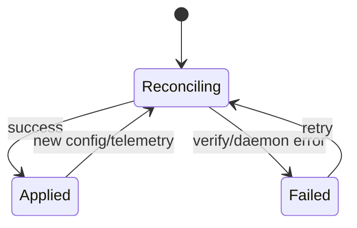

# sdwanlite — Control Plane Architecture

**Phase:** P0+ (control plane scaffold + Orchestrator contract) · **Date:** 2026-08-28 · **Status:** design  
**Inherits:** `docs/ARCHITECTURE.md` (overview + scope boundary)

This document is the **authoritative control-plane contract**: endpoints,
request/response schemas, SQLite schema, error taxonomy, and Orchestrator
behavior. `api-spec.yaml` should be regenerated from this source.

---

## 1. API contract

### 1.1 Endpoints

| Method | Path | Auth | Success | Errors |
|--------|------|------|---------|--------|
| GET | `/healthz` | none | `200 text/plain: ok` | — |
| GET | `/metrics` | none | `200 text/plain` | — |
| POST | `/api/v1/devices/register` | bearer | `201 RegisterResponse` | `401`, `409` |
| GET | `/api/v1/devices` | bearer | `200 [DeviceRecord]` | `401` |
| GET | `/api/v1/devices/{id}` | bearer | `200 DeviceRecord` | `401`, `404` |
| DELETE | `/api/v1/devices/{id}` | bearer | `204` | `401`, `404` |
| GET | `/api/v1/devices/{id}/config` | bearer | `200 DeviceConfig` | `401`, `404` |
| POST | `/api/v1/devices/{id}/apply` | bearer | `200 ApplyOutcome` | `401`, `403`, `409` |
| WS | `/stream/config?device_id={id}` | bearer on upgrade | `101` push config | `401`, `404` |
| POST | `/api/v1/telemetry` | bearer | `200 {accepted:bool}` | `401`, `403`, `404` |

### 1.2 Auth

- Header: `Authorization: Bearer <bootstrap_token>`.
- Constant-time compare in controller.
- WebSocket upgrade **must** send the header on the HTTP upgrade request.
  In-frame token exchange is removed.
- Token source: `--bootstrap-token-file <path>` with file mode `0600`.

### 1.3 Error taxonomy

All error responses use:

```json
{"error": "<machine-readable code>", "message": "see server logs"}
```

Codes:

- `unauthorized` — missing/invalid bearer token.
- `forbidden` — org mismatch.
- `not_found` — unknown device.
- `conflict` — stale config version, verify failure, or duplicate register.
- `internal` — stable branch; never echo implementation details.

---

## 2. Schemas

### 2.1 Device / tenant

```json
{
  "device_id": "uuid",
  "org_id": "uuid",
  "site_id": "uuid",
  "hostname": "string",
  "state": "Registered|Configuring|Active|Degraded|Maintenance",
  "last_seen": "epoch seconds"
}
```

### 2.2 Config

```json
{
  "device_id": "uuid",
  "org_id": "uuid",
  "site_id": "uuid",
  "hostname": "string",
  "version": "integer >= 1",
  "interfaces": [{ "name": "string", "addresses": ["ipv4"], "mtu": 0, "path_label": "string|null" }],
  "tunnels": [{ "kind": "wire_guard", "interface": "string", "path_label": "string", "endpoint": "host:port", "allowed_ips": ["ipv4"], "public_key": "base64", "health_check": { "interval_ms": 1000, "probe_type": "icmp|http|dns|tcp", "threshold": 3, "timeout_ms": 500 } }],
  "routes": [{ "destination": "cidr", "next_hop": "ip", "metric": 100 }],
  "firewall": { "rules": [{ "action": "accept|drop|reject", "source": "string|null", "destination": "string|null", "protocol": "string|null", "port": "integer|null", "comment": "string|null" }] },
  "qos": { "classes": [{ "name": "string", "dscp": 0..63, "bandwidth_bps": 0 }] },
  "path_labels": [{ "id": "uuid", "name": "string", "type": "mpls|internet|5g|starlink|lte|other", "sla": "string" }]
}
```

### 2.3 Apply outcome

```json
{
  "device_id": "uuid",
  "applied_version": "integer",
  "verified": "boolean"
}
```

### 2.4 Telemetry

```json
{
  "device_id": "uuid",
  "org_id": "uuid",
  "uptime_secs": "integer",
  "links": [{ "path_label": "string", "interface": "string", "local_endpoint": "host:port", "tx_bytes": "integer", "rx_bytes": "integer", "peer_endpoint": "string|null" }],
  "flags": [
    { "kind": "link_down", "path_label": "string" },
    { "kind": "degraded", "subsystem": "string" }
  ]
}
```

---

## 3. SQLite schema

```sql
CREATE TABLE IF NOT EXISTS organizations (
    id         TEXT PRIMARY KEY,
    name       TEXT NOT NULL,
    created_at INTEGER NOT NULL
);

CREATE TABLE IF NOT EXISTS sites (
    id         TEXT PRIMARY KEY,
    org_id     TEXT NOT NULL REFERENCES organizations(id) ON DELETE CASCADE,
    name       TEXT NOT NULL,
    created_at INTEGER NOT NULL,
    UNIQUE(org_id, name)
);

CREATE TABLE IF NOT EXISTS devices (
    id         TEXT PRIMARY KEY,
    org_id     TEXT NOT NULL REFERENCES organizations(id) ON DELETE CASCADE,
    site_id    TEXT NOT NULL REFERENCES sites(id) ON DELETE RESTRICT,
    hostname   TEXT NOT NULL,
    state      TEXT NOT NULL,
    last_seen  INTEGER NOT NULL,
    UNIQUE(org_id, hostname)
);

CREATE INDEX IF NOT EXISTS idx_devices_org     ON devices(org_id);
CREATE INDEX IF NOT EXISTS idx_devices_site    ON devices(site_id);

CREATE TABLE IF NOT EXISTS tunnels (
    device_id  TEXT NOT NULL REFERENCES devices(id) ON DELETE CASCADE,
    interface  TEXT NOT NULL,
    public_key TEXT NOT NULL,
    endpoint   TEXT,
    path_label TEXT,
    PRIMARY KEY(device_id, interface)
);

CREATE TABLE IF NOT EXISTS device_configs (
    device_id    TEXT    NOT NULL REFERENCES devices(id) ON DELETE CASCADE,
    version      INTEGER NOT NULL,
    config_json  TEXT    NOT NULL,
    committed_at INTEGER NOT NULL,
    PRIMARY KEY(device_id, version)
);

CREATE INDEX IF NOT EXISTS idx_device_configs_device ON device_configs(device_id);

CREATE TABLE IF NOT EXISTS telemetry_frames (
    id          INTEGER PRIMARY KEY AUTOINCREMENT,
    device_id   TEXT    NOT NULL REFERENCES devices(id) ON DELETE CASCADE,
    org_id      TEXT    NOT NULL REFERENCES organizations(id) ON DELETE CASCADE,
    received_at INTEGER NOT NULL,
    frame_json  TEXT    NOT NULL
);

CREATE INDEX IF NOT EXISTS idx_telemetry_device_time ON telemetry_frames(device_id, received_at);

CREATE TABLE IF NOT EXISTS health_flags (
    id          INTEGER PRIMARY KEY AUTOINCREMENT,
    device_id   TEXT    NOT NULL REFERENCES devices(id) ON DELETE CASCADE,
    raised_at   INTEGER NOT NULL,
    cleared_at  INTEGER,
    kind        TEXT    NOT NULL,
    detail_json TEXT    NOT NULL
);

CREATE INDEX IF NOT EXISTS idx_health_flags_device ON health_flags(device_id);
CREATE INDEX IF NOT EXISTS idx_health_flags_active ON health_flags(cleared_at) WHERE cleared_at IS NULL;
```

Notes:

- Wire-private keys are **never** stored in `device_configs.config_json` or
  `tunnels.public_key` beyond the public half.
- SQLite file must be opened with mode `0600` in P1+.

---

## 4. State machine

```
register      → Registered
apply OK      → Configuring → Active
telemetry bad → Degraded
delete        → removed
```

- `Registered`: device known, no active config push yet.
- `Configuring`: config applied, data-plane verification in progress.
- `Active`: config verified and running.
- `Degraded`: health flag raised; Orchestrator may retry or fallback.
- `Maintenance`: reserved for P2+.

Transitions are emitted by controller handlers and executed by the
Orchestrator.

---

## 5. Orchestrator contract

### 5.1 Inputs

- `DeviceRecord`
- `DeviceConfig`
- `TelemetryFrame`
- `HealthFlag`

### 5.2 Outputs

- `DaemonCommand` jobs written to existing daemon surfaces:
  - `/run/*.json`
  - `sdwan-overlay` AF_UNIX socket
  - future typed FFI in P1

### 5.3 Rules

- **Idempotent**: retries must not double-apply.
- **Read-mostly**: polls store/telemetry; not on the latency-critical path.
- **Isolated**: never blocks controller API; runs in separate task.
- **Safety-gated**: requires `--enable-live-actions` + non-loopback +
  `0600` token file.

### 5.4 Lifecycle



---

## 6. Agent contract

### 6.1 Bootstrap

1. Read bootstrap token from `0600` file.
2. `POST /api/v1/devices/register` with `device_id`, `org_id`, `site_id`,
   `hostname`, `version`.
3. Receive `current_version` + `stream_url`.

### 6.2 Sync

- Push path: controller commits new `DeviceConfig` → WS push →
  `apply_config` → data-plane apply.
- Pull path: agent posts `TelemetryFrame` every 10 s → controller stores +
  updates `last_seen`.

### 6.3 Apply invariants

- Reject stale version before verify.
- `verify_fn` runs only on new config.
- Failure leaves old config live; version unchanged.
- Agent must reject configs whose `org_id` does not match registered org.

---

## 7. Security & operational guardrails

- Loopback default for all control-plane binds.
- Non-loopback requires explicit operator intent:
  `--enable-live-actions` + `--bootstrap-token-file` mode `0600`.
- No secrets in logs or error responses.
- All example addresses are RFC 5737 documentation addresses.
- Data-plane mutations happen only via Orchestrator → existing daemon
  surfaces; controller never directly changes routing/nftables/WG.
