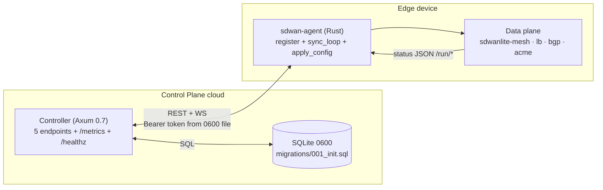

# sdwanlite Control Plane — Architecture (P0)

**Phase:** P0 (control-plane scaffold) · **Date:** 2026-08-27 · **Status:** scaffolded
**Inherits:** `docs/ARCHITECTURE.md` (data plane — unchanged by P0)

---

## 0. Scope boundary

P0 adds a new control plane alongside the Phase-4 data plane. **No file in
`crates/mesh`, `crates/lb`, `crates/bgp`, `crates/acme`, `crates/app`, the
Python daemons, or `sdwan-dps/` was touched.** P0 is additive only.

| Layer        | Crates / artefacts              | Touched by P0 |
|--------------|----------------------------------|----------------|
| Control plane | `crates/sdwan-core`, `crates/sdwan-agent`, `api-spec.yaml`, `docs/ARCHITECTURE-P0.md`, `migrations/001_init.sql` | **yes (new)** |
| Data plane   | `crates/mesh` (smoltcp + boringtun), `crates/lb`, `crates/bgp`, `crates/acme`, `crates/app`, `crates/core` (data-plane types), `crates/web` | no |
| DPS daemons  | `sdwan-dps/{monitor,pbr,overlay,routing}/`, `/run/*.json` | no |

The control plane talks to the data plane **only** through the existing
on-device APIs (the `crates/app` REST surface, the `sdwan-overlay` AF_UNIX
socket, etc.). P1 will add typed FFI seams; P0 keeps the boundary at the
public sockets.

---

## 1. Components



### 1.1 `sdwan-core` — type system

`crates/sdwan-core` defines the wire model only:

* `DeviceConfig { device_id, org_id, site_id, hostname, interfaces, tunnels,
  routes, firewall, qos, path_labels, version }`
* `Interface { name, addresses, mtu, path_label }`
* `TunnelConfig::WireGuard { interface, path_label, health_check, endpoint,
  allowed_ips, public_key }` — IPsec/SSTP slot for P1
* `PathLabel { id, name, type: Mpls|Internet|5G|Starlink|Lte|Other, sla }`
* `HealthCheckConfig { interval_ms, probe_type: Icmp|Http|Dns|Tcp, threshold,
  timeout_ms }`
* IDs are branded newtypes (`DeviceId`, `OrgId`, `SiteId`, `ConfigVersion`,
  `BootstrapToken`): identical JSON wire format (`#[serde(transparent)]`),
  impossible to confuse at compile time. `TunnelId` / `InterfaceId` exist as
  P1-reserved types but carry **no wire fields** in P0 (matches
  `api-spec.yaml`).
* Every public enum is `#[non_exhaustive]`; every wire type derives
  `schemars::JsonSchema` so `api-spec.yaml` can be regenerated mechanically.
  `ValidatedConfig` wraps a config that passed `DeviceConfig::validate`; the
  apply path only accepts that type.
* `TunnelConfig::WireGuard::public_key` is **only the public** key. Private
  keys are generated on-device and never leave `0600` files (AGENTS.md).

### 1.2 `sdwan-agent` — edge binary

`sdwan-agent` runs in two modes (`--mode agent|controller`).

* `--mode agent`: bootstrap → `register()` → `sync_loop()` (WS) → periodic
  `get_telemetry()`. Config apply goes through the **transactional**
  `Agent::apply_config(new) → ApplyOutcome` — see §2.
* `--mode controller`: runs the in-process Axum controller with the 5
  endpoints from `api-spec.yaml`. SQLite-backed in P0 via the
  `migrations/001_init.sql` schema; in-memory `DeviceStore` for P0.

Both modes bind loopback by default; non-loopback requires
`--enable-live-actions` and a `0600` `--bootstrap-token-file`.

---

## 2. Transactional `apply_config` — sequence

```mermaid
sequenceDiagram
    autonumber
    participant Ctl as Controller
    participant Agt as Agent
    participant Vfy as verify_fn (data-plane seam)
    participant Swap as ArcSwap<DeviceConfig>

    Ctl->>Agt: push config v{N+1} (WS /stream/config)
    Agt->>Agt: snapshot = current.load()
    Agt->>Agt: reject if v{N+1} <= snapshot.version  (stale)
    Agt->>Vfy: verify(&new)
    alt verify OK
        Vfy-->>Agt: Ok(())
        Agt->>Swap: store(new)  — the pushed revision, unchanged
        Swap-->>Agt: active v{N+1}
        Agt-->>Ctl: ApplyOutcome { verified: true, active_version: v{N+1} }
    else verify Err(msg)
        Vfy-->>Agt: Err(msg)
        Note over Agt,Swap: snapshot stays live; no bump
        Agt-->>Ctl: ApplyOutcome { verified: false,<br/>active_version: snapshot.version, error: msg }
    end
```

**Invariants (proven by `crates/sdwan-agent/tests/transactional_apply.rs`):**

* `verify_fn` returning `Ok(())`  → new config becomes active at the pushed
  revision, `active_version == new_version`. Versions are controller-owned:
  the controller mints strictly increasing revisions; the agent mirrors them
  exactly (no side-band bump — a second push is never silently dropped).
* `verify_fn` returning `Err(_)`  → snapshot stays live, `version` unchanged,
  old config remains active.
* Stale `new.version <= current.version` is rejected **before** `verify_fn`
  is called (no resource spend on rejected pushes).
* Sequential successful applies keep `version` strictly monotonic.

---

## 3. Transport & security

| Concern        | Choice (P0)                              | Notes |
|----------------|------------------------------------------|-------|
| HTTP transport | `http://127.0.0.1:8080`                  | loopback default per AGENTS.md |
| Auth header    | `Authorization: Bearer <bootstrap_token>` | constant-time compare in controller |
| Token storage  | `--bootstrap-token-file <path>`          | file must be mode `0600` (verified at startup on Unix); never echoed |
| WebSocket      | `ws://127.0.0.1:8080/stream/config?device_id=<uuid>` | bearer via `Authorization` header on the upgrade request (RFC 6455 handshake built with `IntoClientRequest`); server pushes deltas |
| Examples       | RFC 5737 (`192.0.2.x`, `198.51.100.x`, `203.0.113.7`) | no real IPs |
| Multi-tenant   | every resource carries `org_id`/`site_id` | controller rejects cross-tenant apply/telemetry |
| Error hygiene  | `ErrorBody { error: <code>, message: "see server logs" }` | the code branch is stable; full error never echoed (avoids leaking endpoints/tokens) |

---

## 4. SQLite schema (P0 → P1 wiring)

`migrations/001_init.sql` defines the durable schema. P0 keeps the in-memory
`DeviceStore` so the migration is **declarative** — P1 swaps `DeviceStore`
for `Storage` backed by `rusqlite` with the same `insert / get /
replace_config` contract.

```sql
CREATE TABLE organizations (
    id          TEXT PRIMARY KEY,        -- UUID v4
    name        TEXT NOT NULL,
    created_at  INTEGER NOT NULL         -- epoch seconds
);
CREATE TABLE sites (
    id          TEXT PRIMARY KEY,
    org_id      TEXT NOT NULL REFERENCES organizations(id),
    name        TEXT NOT NULL,
    created_at  INTEGER NOT NULL
);
CREATE TABLE devices (
    id          TEXT PRIMARY KEY,
    org_id      TEXT NOT NULL REFERENCES organizations(id),
    site_id     TEXT NOT NULL REFERENCES sites(id),
    hostname    TEXT NOT NULL,
    last_seen   INTEGER NOT NULL,
    UNIQUE(org_id, hostname)
);
CREATE TABLE tunnels (
    device_id   TEXT NOT NULL REFERENCES devices(id),
    interface   TEXT NOT NULL,
    public_key  TEXT NOT NULL,
    endpoint    TEXT,
    path_label  TEXT,
    PRIMARY KEY(device_id, interface)
);
CREATE TABLE device_configs (
    device_id   TEXT NOT NULL REFERENCES devices(id),
    version     INTEGER NOT NULL,
    config_json TEXT NOT NULL,           -- canonical DeviceConfig payload
    committed_at INTEGER NOT NULL,
    PRIMARY KEY(device_id, version)
);
```

Wire-private keys are NOT stored in `device_configs.config_json` (the
serialised `TunnelConfig::WireGuard` carries only the **public** key). The
agent's WireGuard private key lives in an unlinked `0600` file on the device
itself — see `crates/mesh/src/vpn.rs` (existing) for the precedent.

---

## 5. flexiWAN coverage map (P0 → P3)

| §  | flexiWAN menu group        | P0 | P1 | P2 | P3 |
|----|-----------------------------|----|----|----|----|
| 1  | Management Core (Org/Site/Device, RBAC) | **✓** types + multi-tenant guards | RBAC, JWT | | |
| 2  | Device Config / Settings    | **✓** bootstrap + transactional apply | hot reload UI | | |
| 3  | Device Actions              |     | systemd units | | |
| 4  | Routing (Static/OSPF/BGP)   |     | ✓ (FRR render) | | |
| 5  | Tunnels (WG/IPsec/STUN)     |     | ✓ | HA pair | |
| 6  | Traffic & nDPI              |     | ✓ | | |
| 7  | Firewall (nftables)         |     | ✓ | | |
| 8  | LAN NAT                     |     | ✓ | | |
| 9  | Link Monitors               | **✓** `HealthCheckConfig` types | ✓ daemon wire | | |
| 10 | Path Labels                 | **✓** first-class types | | AI-healing | |
| 11 | Path Selection Policy       |     | ✓ (QBR) | | |
| 12 | QoS (HTB/TC)                |     | ✓ | | |
| 13 | IPsec Peering               |     | ✓ | | |
| 14 | AI Network Healing          |     | | ✓ | |
| 15 | High Availability           |     | | ✓ | |
| 16 | Dashboards (Grafana)        |     | | | ✓ |
| 17 | North Bound API             |     | | | ✓ |
| 18 | Upgrade / Billing / ZTP     |     | | | ✓ |

P0 deliberately leaves the existing `crates/web` Dioxus dashboard untouched;
the flexiWAN-style admin UI lands in P3 alongside Grafana/NB API.

---

## 6. P1 / P2 / P3 — what lands next

**P1** (data plane wiring):
* `sdwan-overlay` (`crates/mesh`) calls `Agent::set_verify(...)` so real WG
  installs feed the verify step.
* `sdwan-routing` (`sdwan-dps/routing`) wires to `TunnelConfig` + `Route` deltas.
* `sdwan-firewall` renders `FirewallPolicy` → nftables.
* `sdwan-qos` renders `QosPolicy` → HTB/TC.
* `sdwan-linkmon` calls `HealthCheckConfig::probe_type` for ICMP/UDP-DNS/HTTP.
* Swap `DeviceStore` for SQLite-backed `Storage` using `migrations/001_init.sql`.

**P2**: anomaly detection, HA, AI-healing (rule-based v1).

**P3**: Northbound REST + Terraform provider, Grafana + geoIP, controller
admin UI (warm cream light theme, flexiWAN-style modals), staged upgrade,
billing stub.

---

## 7. Build & run

```bash
cargo check -p sdwan-core
cargo check -p sdwan-agent
cargo test  -p sdwan-agent    # unit + integration + property + snapshot tests
cargo test  -p sdwan-core     # serde roundtrips + proptest property tests

# Agent (loopback controller):
cargo run -p sdwan-agent -- --mode controller \
    --bind 127.0.0.1:8080 \
    --bootstrap-token test

# Edge agent (registers + subscribes via WS):
cargo run -p sdwan-agent -- \
    --controller http://127.0.0.1:8080 \
    --bootstrap-token test \
    --device-id 11111111-1111-1111-1111-111111111111 \
    --org-id    22222222-2222-2222-2222-222222222222 \
    --site-id   33333333-3333-3333-3333-333333333333 \
    --hostname  edge-01
```

Non-loopback production:
```bash
SDWANLITE_API_TOKEN_FILE=/etc/sdwanlite/token.0600 \
  cargo run --release -p sdwan-agent -- --mode controller \
    --bind 0.0.0.0:8443 \
    --bootstrap-token-file /etc/sdwanlite/token.0600 \
    --enable-live-actions
```

(TLS termination in P1 — the controller speaks plain HTTP/WS in P0; front it
with a reverse proxy or wire `axum-server` with rustls in P1.)
