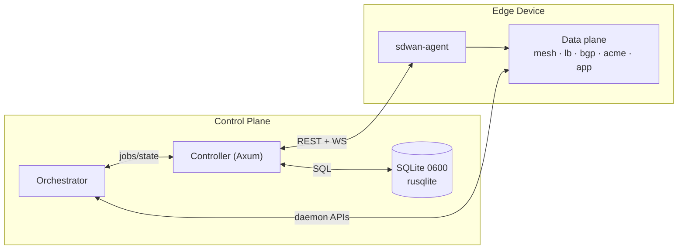
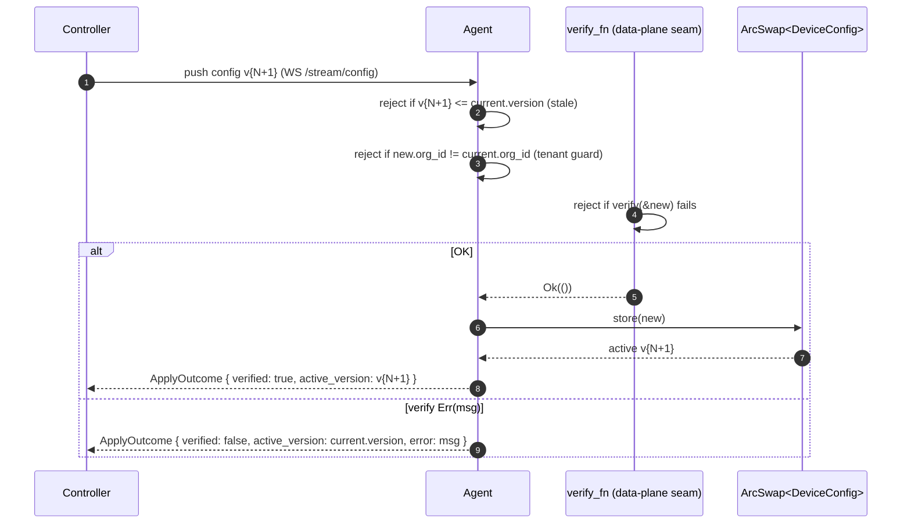

# sdwanlite — Architecture

**Phase:** P0+ (control plane scaffold + Orchestrator contract) · **Date:** 2026-08-28 · **Status:** design

This document is the architecture index. For control-plane API, schema, and
Orchestrator contract details, see `docs/ARCHITECTURE-CONTROL.md`.

---

## 0. Scope boundary

| Layer | Crates / artefacts | Touched by this design |
|-------|--------------------|------------------------|
| Control plane | `crates/sdwan-core`, `crates/sdwan-agent`, `api-spec.yaml`, `docs/ARCHITECTURE-CONTROL.md`, `migrations/001_init.sql` | yes |
| Data plane | `crates/mesh` (smoltcp + boringtun), `crates/lb`, `crates/bgp`, `crates/acme`, `crates/app`, `crates/core` (data-plane types), `crates/web` | no |
| DPS daemons | `sdwan-dps/{monitor,pbr,overlay,routing}/`, `/run/*.json` | Orchestrator calls only |

The control plane talks to the data plane **only** through existing
on-device APIs (`crates/app` REST surface, `sdwan-overlay` AF_UNIX socket,
etc.). P1 adds typed FFI seams; this design keeps the boundary at public
sockets.

---

## 1. Components



### 1.1 `sdwan-core` — type system

`crates/sdwan-core` defines the wire model only:

- `DeviceConfig`, `Interface`, `TunnelConfig`, `PathLabel`,
  `HealthCheckConfig`, `Route`, `FirewallPolicy`, `QosPolicy`.
- IDs are branded newtypes (`DeviceId`, `OrgId`, `SiteId`, `ConfigVersion`,
  `BootstrapToken`): identical JSON wire format, impossible to confuse at
  compile time.
- Every public enum is `#[non_exhaustive]`; every wire type derives
  `schemars::JsonSchema` so `api-spec.yaml` can be regenerated mechanically.
- `ValidatedConfig` wraps a config that passed `DeviceConfig::validate`; the
  apply path only accepts that type.
- `TunnelConfig::WireGuard::public_key` is **only the public** key. Private
  keys are generated on-device and never leave `0600` files.

### 1.2 `sdwan-agent` — edge binary

`sdwan-agent` runs in two modes (`--mode agent|controller`).

- `--mode agent`: bootstrap → `register()` → `sync_loop()` (WS) →
  periodic `get_telemetry()`. Config apply goes through the transactional
  `Agent::apply_config(new) → ApplyOutcome`.
- `--mode controller`: runs the in-process Axum controller with the
  endpoints from `docs/ARCHITECTURE-CONTROL.md`. SQLite-backed via
  `migrations/001_init.sql`; Orchestrator runs inside this mode.

Both modes bind loopback by default; non-loopback requires
`--enable-live-actions` and a `0600` `--bootstrap-token-file`.

---

## 2. Transactional `apply_config` — sequence



Invariants:

- Stale or cross-org configs are rejected **before** `verify_fn` runs.
- Successful apply bumps to the pushed revision; failure leaves old config
  live.
- Sequential successful applies keep `version` strictly monotonic.

---

## 3. Transport & security

| Concern | Choice | Notes |
|---------|--------|-------|
| HTTP transport | `http://127.0.0.1:8080` | loopback default |
| Auth header | `Authorization: Bearer <bootstrap_token>` | constant-time compare in controller |
| Token storage | `--bootstrap-token-file <path>` | file must be mode `0600` |
| WebSocket | `ws://127.0.0.1:8080/stream/config?device_id=<uuid>` | bearer on upgrade request |
| Multi-tenant | every resource carries `org_id`/`site_id` | controller rejects cross-tenant apply/telemetry |
| Error hygiene | `ErrorBody { error: <code>, message: "see server logs" }` | never echo internals |

Address hygiene: all examples use RFC 5737 documentation addresses
(`192.0.2.x`, `198.51.100.x`, `203.0.113.x`). No real IPs.

---

## 4. Orchestrator

The Orchestrator is a control-plane coordinator, not a new network service.
It runs inside controller mode, watches store + telemetry, and emits intent
to existing data-plane daemons.

Responsibilities:

- reconcile `DeviceConfig` → data-plane state
- react to `TelemetryFrame` / `HealthFlag`
- emit `DaemonCommand` jobs via existing `/run/*.json` sockets
- update `DeviceState` lifecycle

Constraints:

- **read-mostly**: polls store/telemetry; no latency-critical path.
- **idempotent**: retries must not double-apply.
- **isolated**: never blocks controller API; separate task.
- **safety-gated**: requires `--enable-live-actions` for production.

---

## 5. Build & run

```bash
cargo check -p sdwan-core
cargo check -p sdwan-agent
cargo test  -p sdwan-agent
cargo test  -p sdwan-core

# Controller:
cargo run -p sdwan-agent -- --mode controller \
    --bind 127.0.0.1:8080 \
    --bootstrap-token-file /etc/sdwanlite/token.0600

# Edge agent:
cargo run -p sdwan-agent -- \
    --controller http://127.0.0.1:8080 \
    --bootstrap-token-file /etc/sdwanlite/token.0600 \
    --device-id 11111111-1111-1111-1111-111111111111 \
    --org-id    22222222-2222-2222-2222-222222222222 \
    --site-id   33333333-3333-3333-3333-333333333333 \
    --hostname  edge-01
```

Non-loopback production requires `--enable-live-actions`.
